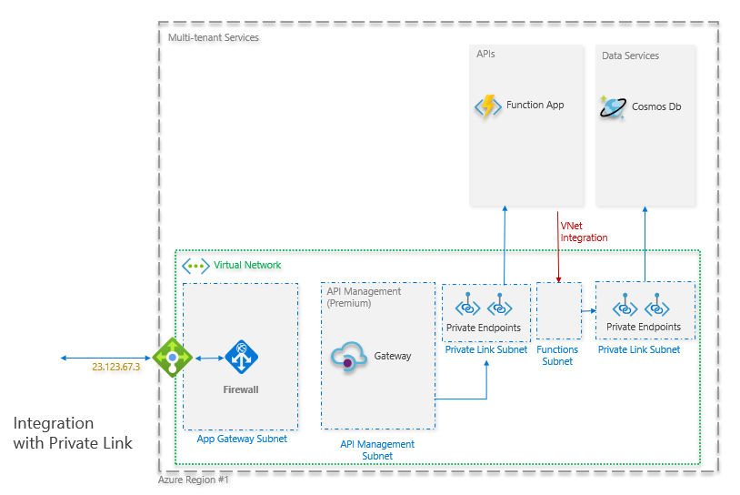

# Azure Modern Apps - Integration Starter
This is an open source  starter for building enterprise integration leveraging Microsoft Azure. 

## Defintition of done
- PR reviewed by at least one core team member.

## Install instructions
1. Add connection string to keys in github or locally in localsettings.json
2. Add connection string to app service configuration for functions

### ARM Templates
An Infrastructure as Code (IaC) approach will be taken for the Azure platform deployment. Generic ARM templates will be created for each resource type. This is so that multiple instances of a given resource type can be deployed using the same template. CI/CD pipelines will orchestrate the platform deployment.

## Info
Github actions deployment:
- https://github.com/marketplace/actions/azure-functions-action

## Branching
This project will follow the [GitHub Flow](https://guides.github.com/introduction/flow) branching strategy . 

- This easy to follow strategy has one trunk branch "master" that contains the latest stable codebase, that is always in a stable deployable state. 
- Developers create a new branch off of master every time they want to develop a new feature, fix a bug or experiment with new ideas. 
- Once the code is ready a Pull Request (PR) is raised to merge the branch back into master, a CI build and Unit Tests can execute on the branch to ensure the code is stable and other developers can review the code and make comments. 
- Once all checks have passed the PR can be completed and the code merged back into master.

### Naming Conventions
When working on large projects with multiple developers a consistent branching strategy is important. The convention followed can be defined to suit the teams needs and requirements, the important point is to maintain consistency. 

For this project we will follow the format "grouping/issueNumber-description" where:
- **grouping** is a logical grouping such as 'feature' or 'bugfix'
- **issueNumber** is the GitHub issue number you are working on. This can be omitted for experimental branches that don't have a related issue
- **description** is a short description of the changes

Example branch names:
- feature/12-implement-auth
- bugfix/44-api-version-error
- experimental/test-beta-search-api

*Note: All branch names should be in lowercase and use hyphen (-) to seperate words*
